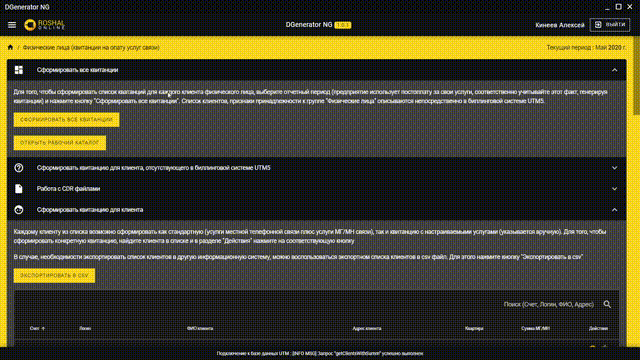
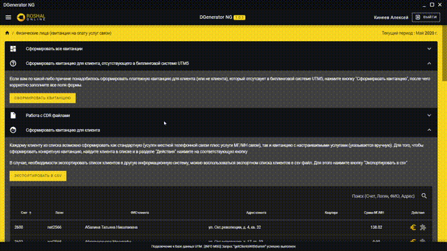
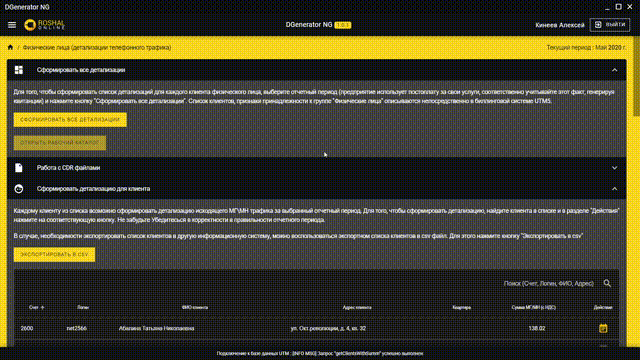

# DGenerator NG

This application is intended only for acquaintance with the quality of my code. It can be assembled. To work, you need to connect to the server with mysql base UTM5

## Used technologies

Quasar, Electron, Vue, Vuex, Vue-router, MySQL over SSH

## Target platform

Windows x86\64

## UI Samples

